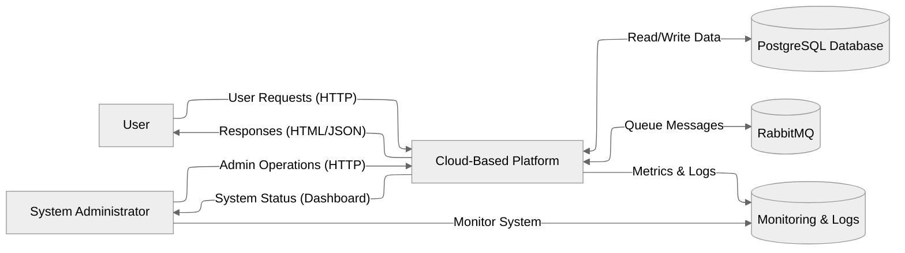
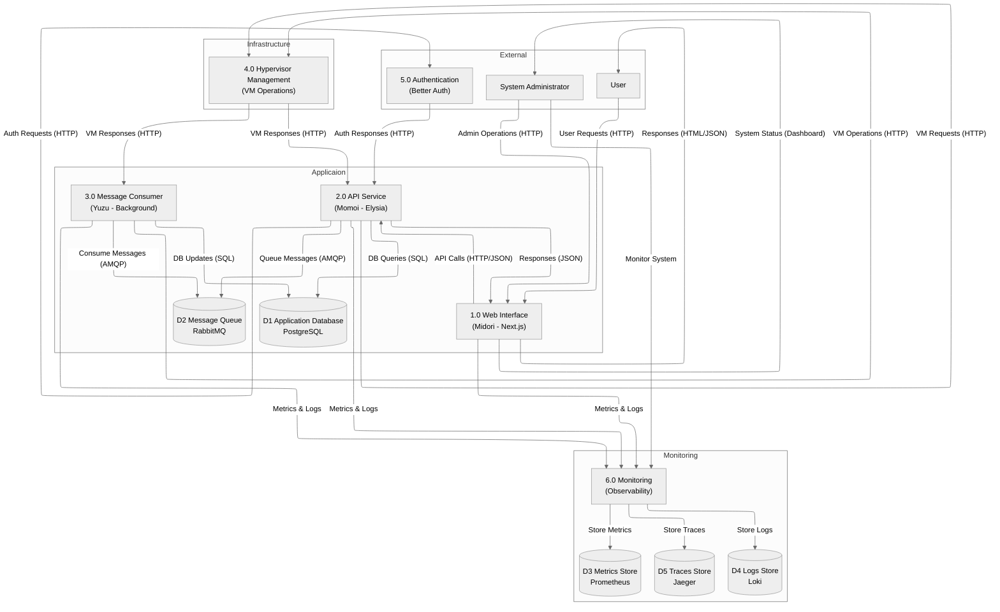

# Cloud-Based Platform - Data Flow Analysis

## Project Overview

This document provides a comprehensive analysis of the cloud-based platform architecture, including data flow diagrams from Level 0 to Level 1. The platform is built using modern technologies and follows microservices architecture patterns.

## Architecture Components

### Applications
- **Midori** - Next.js frontend application (React-based web interface)
- **Momoi** - Elysia-based backend API service (REST/HTTP API)
- **Yuzu** - Message consumer service (RabbitMQ-based background processing)

### Shared Packages
- **Auth** - Better Auth integration for authentication and authorization
- **Database** - PostgreSQL with Prisma ORM for data persistence
- **Utils** - Shared utility functions and helpers

### Infrastructure Services
- **PostgreSQL** - Primary database for application data
- **RabbitMQ** - Message queue for asynchronous processing
- **Jaeger** - Distributed tracing for observability
- **Prometheus** - Metrics collection and storage
- **Grafana** - Monitoring dashboards and visualization
- **Loki** - Centralized logging system

## Technology Stack

### Frontend (Midori)
- **Framework**: Next.js 15.5.2 with React 19.1.0
- **UI Library**: Material-UI (MUI) 7.3.2
- **Styling**: Tailwind CSS 4.0
- **Icons**: Lucide React, MUI Icons
- **Authentication**: Better Auth client integration

### Backend (Momoi)
- **Framework**: Elysia 1.3.21 (Bun-based web framework)
- **Runtime**: Bun
- **API Documentation**: OpenAPI/Swagger integration
- **Validation**: Zod schema validation
- **Logging**: Pino with Loki integration
- **Monitoring**: Prometheus metrics, OpenTelemetry tracing
- **CORS**: Cross-origin resource sharing support
- **Cron Jobs**: Scheduled task execution

### Consumer (Yuzu)
- **Runtime**: Bun
- **Message Queue**: AMQP (RabbitMQ) integration
- **Logging**: Pino with Loki integration
- **HTTP Client**: Axios for external API calls
- **Performance Testing**: Built-in performance testing capabilities

### Database & ORM
- **Database**: PostgreSQL
- **ORM**: Prisma with client generation
- **Schema Management**: Prisma migrations
- **Type Generation**: Prismabox for Elysia integration

## Level 0 Data Flow Diagram

The Level 0 diagram shows the high-level system view with external entities and major data flows.

### Level 0 Components Description

#### External Entities
- **User**: End users interacting with the web application
- **System Administrator**: Operations team monitoring and managing the system

#### Main System
- **Cloud-Based Platform**: The complete system encompassing all applications and services

#### Data Stores
- **PostgreSQL Database**: Persistent storage for application data
- **RabbitMQ**: Message queue for asynchronous processing
- **Monitoring & Logs**: Observability stack (Prometheus, Grafana, Jaeger, Loki)

## Level 1 Data Flow Diagram

The Level 1 diagram breaks down the main system into detailed processes and shows specific data flows between components.

### Level 1 Components Description

#### Processes

**1.0 Web Interface (Midori)**
- **Technology**: Next.js with React 19, Material-UI, Tailwind CSS
- **Responsibilities**: 
  - Serve user interface
  - Handle user interactions
  - Communicate with backend APIs
  - Manage client-side authentication state
- **Data Flows**: Receives user requests, sends API calls to backend, displays responses

**2.0 API Service (Momoi)**
- **Technology**: Elysia framework on Bun runtime
- **Responsibilities**:
  - Handle REST API requests
  - Business logic processing
  - Database operations via Prisma ORM
  - Queue message publishing
  - API documentation (OpenAPI/Swagger)
- **Data Flows**: Processes API requests, validates authentication, performs database operations

**3.0 Message Consumer (Yuzu)**
- **Technology**: Bun runtime with AMQP integration
- **Responsibilities**:
  - Consume messages from RabbitMQ
  - Process background tasks
  - Handle VM operations
  - Update processing status
- **Data Flows**: Consumes queue messages, processes data, updates database

**4.0 Hypervisor Management (VM Operations)**
- **Technology**: Proxmox VE API
- **Responsibilities**:
  - Manage virtual machines (create, start, stop, delete)
  - Interface with Proxmox VE for VM lifecycle management
  - Handle VM-related requests from API service
- **Data Flows**: Manages VM state changes, communicates with Proxmox API

**5.0 Authentication (Better Auth)**
- **Technology**: Better Auth library
- **Responsibilities**:
  - User authentication and authorization
  - Session management
  - Token generation and validation
  - User data management
- **Data Flows**: Handles auth requests, validates tokens, manages user sessions

**6.0 Monitoring (Observability)**
- **Technology**: Prometheus, Grafana, Jaeger, Loki
- **Responsibilities**:
  - Collect metrics from all services
  - Aggregate and store logs
  - Distributed tracing
  - Provide monitoring dashboards
- **Data Flows**: Collects metrics and logs, provides monitoring interfaces

#### Data Stores

**D1 - Application Database (PostgreSQL)**
- **Purpose**: Primary data storage for application entities
- **Schema Management**: Prisma migrations
- **Access Pattern**: CRUD operations via Prisma ORM

**D2 - Message Queue (RabbitMQ)**
- **Purpose**: Asynchronous message processing
- **Message Types**: VM operations, background tasks
- **Access Pattern**: Producer-consumer pattern

**D3 - Metrics Store (Prometheus)**
- **Purpose**: Time-series metrics storage
- **Data Types**: Application metrics, system metrics, custom metrics
- **Access Pattern**: Write metrics, query for dashboards

**D4 - Logs Store (Loki)**
- **Purpose**: Centralized log aggregation
- **Data Types**: Application logs, error logs, audit logs
- **Access Pattern**: Write logs, query for debugging

**D5 - Traces Store (Jaeger)**
- **Purpose**: Distributed tracing storage
- **Data Types**: Request traces, span data, performance metrics
- **Access Pattern**: Write traces, query for performance analysis

## Data Flow Descriptions

### Primary User Flows

1. **User Web Interaction**
   - User accesses web interface (Midori)
   - Frontend serves HTML/CSS/JavaScript
   - User interactions trigger API calls to backend

2. **API Processing**
   - Frontend sends REST API calls to Momoi
   - Backend validates authentication tokens
   - Business logic processing and database operations
   - JSON responses returned to frontend

3. **Background Processing**
   - API service queues messages for background processing
   - Yuzu consumer processes messages asynchronously
   - Results updated in database and optionally notified back to API

### Authentication Flow

1. **Login Process**
   - User submits credentials via frontend
   - Frontend sends auth request to Better Auth
   - Auth service validates credentials and generates tokens
   - Tokens stored in frontend for subsequent requests

2. **Request Authorization**
   - Frontend includes auth tokens in API requests
   - API service validates tokens with auth service
   - User context provided for authorized operations

### Monitoring and Observability

1. **Metrics Collection**
   - All services emit metrics to Prometheus
   - Custom business metrics and system metrics
   - Grafana dashboards for visualization

2. **Logging**
   - Structured logging from all services
   - Centralized in Loki for searching and analysis
   - Error tracking and audit trails

3. **Distributed Tracing**
   - Request tracing across service boundaries
   - Performance monitoring and bottleneck identification
   - Stored in Jaeger for analysis

## Deployment Architecture

### Docker Services
The platform uses Docker Compose for orchestration with the following services:

- **Database**: PostgreSQL with persistent storage
- **Message Queue**: RabbitMQ with management interface
- **Monitoring Stack**: Jaeger, Prometheus, Grafana, Loki
- **Applications**: Midori (frontend), Momoi (API), Yuzu (consumer)

### Port Configuration
- **Frontend (Midori)**: Port 3000
- **API (Momoi)**: Port 3001
- **PostgreSQL**: Port 5432
- **RabbitMQ**: Port 5672 (AMQP), 15672 (Management)
- **Grafana**: Port 3002
- **Prometheus**: Port 9090
- **Jaeger UI**: Port 16686
- **Loki**: Port 3100

## Development Workflow

### Workspace Structure
The project uses a monorepo structure with Bun workspaces:
- `apps/`: Application services (midori, momoi, yuzu)
- `packages/`: Shared packages (auth, database, utils)
- `config/`: Configuration files and service configs
- `docker/`: Dockerfiles for each service
- `docs/`: Documentation and project artifacts

### Key Technologies
- **Runtime**: Bun for backend services
- **Frontend**: Next.js with React
- **Backend**: Elysia web framework
- **Database**: PostgreSQL with Prisma ORM
- **Message Queue**: RabbitMQ with AMQP
- **Monitoring**: Full observability stack
- **Container**: Docker with Docker Compose

## Conclusion

This cloud-based platform demonstrates a modern, scalable architecture with:
- Clear separation of concerns across services
- Asynchronous processing capabilities
- Comprehensive monitoring and observability
- Type-safe development with TypeScript
- Modern runtime and framework choices
- Production-ready containerization

The data flow diagrams provide a clear understanding of how data moves through the system, from user interactions to background processing and monitoring.