# Cloud-Based Platform User Flow

### Table of Contents
- [Cloud-Based Platform User Flow](#cloud-based-platform-user-flow)
    - [Table of Contents](#table-of-contents)
    - [Authentication](#authentication)
    - [Dashboard Overview](#dashboard-overview)
    - [Student Flow - Frontend](#student-flow---frontend)
      - [Instance Request](#instance-request)
      - [After Request Approval](#after-request-approval)
      - [Instance Extension Request](#instance-extension-request)
      - [Reverse Proxy Configuration](#reverse-proxy-configuration)
    - [Lecturer and Admin Flow - Frontend](#lecturer-and-admin-flow---frontend)
      - [Instance Approval Request](#instance-approval-request)
      - [Bulk Approval of Instance Requests](#bulk-approval-of-instance-requests)
      - [Instance Extension Approval Request and Bulk Approval](#instance-extension-approval-request-and-bulk-approval)
      - [Instance Management by Lecturer/Admin](#instance-management-by-lectureradmin)
    - [Admin Flow - Frontend](#admin-flow---frontend)
      - [Course Management](#course-management)
      - [Semester Management](#semester-management)
      - [Lecture Management](#lecture-management)

### Authentication
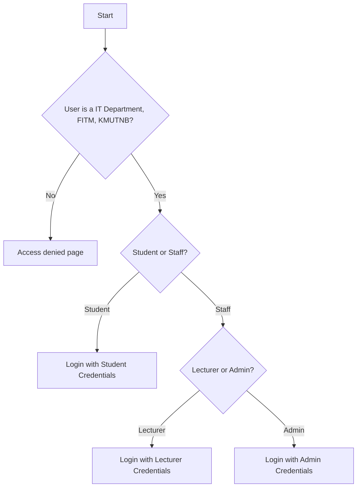

### Dashboard Overview
```mermaid
flowchart LR
    A[Login Successful] --> B{User Role}
    B -- Student --> C[Student Dashboard]
    B -- Lecturer --> D[Lecturer Dashboard]
    B -- Admin --> E[Admin Dashboard]

    C --> C1[Overview]
    C --> C2[Instances]
    C --> C3[Instance requests]
    C --> C4[Instance extensions requests]

    D --> D1[Overview]
    D --> D2[Instances]
    D --> D4[Instance creation]
    D --> D3[Instances management]
    D --> D5[Instance approval requests]

    E --> E1[Overview]
    E --> E2[All instances management]
    E --> E3[All instance requests management]
    E --> E4[All instance extensions and requests management]
    E --> E5[Course management]
    E --> E6[Semester management]
    E --> E7[Lecture management]
    <!-- E --> E8[Template management - Future Work] -->
```

### Student Flow - Frontend

#### Instance Request
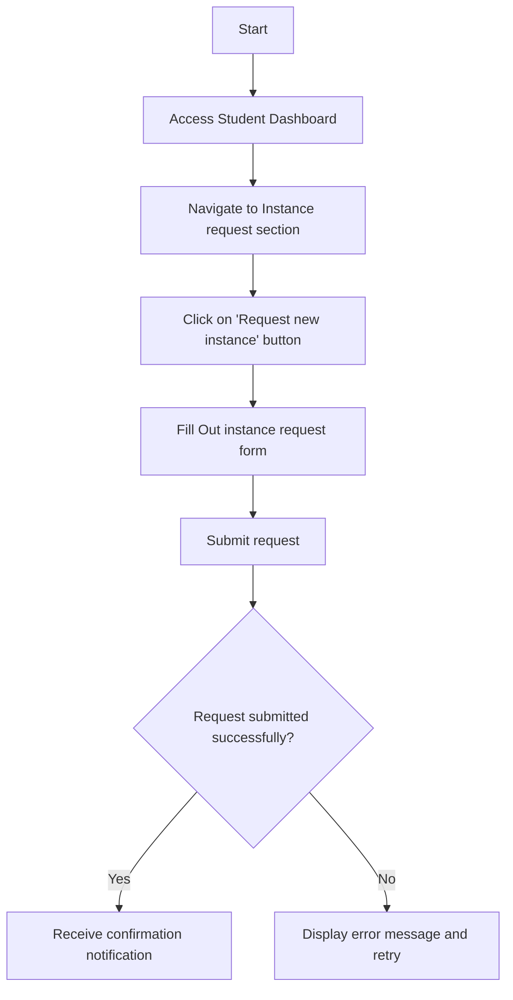

- **Instance request form details**
  - Required Fields:
    - Title for instance request
    - Description for instance request
    - Course selection
    - Template selection (Operating System and Software)
    - Instance specifications (CPU, RAM, Storage)
  - Optional Fields:
    - Instance details (Hostname) - if left blank, a random hostname will be generated

#### After Request Approval
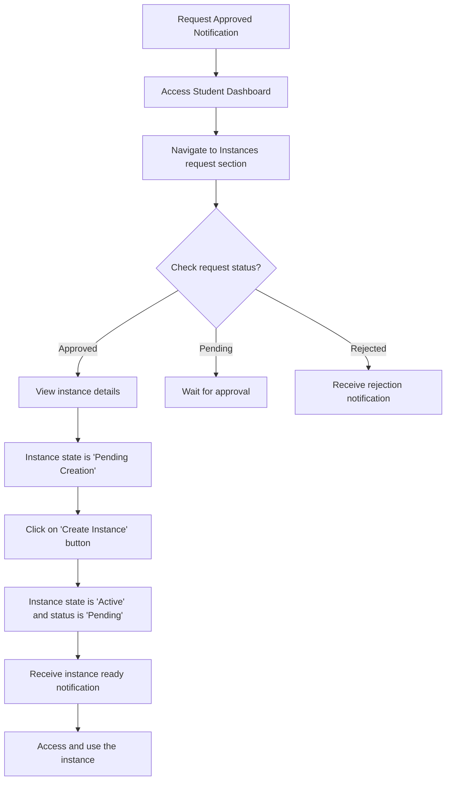

#### Instance Extension Request
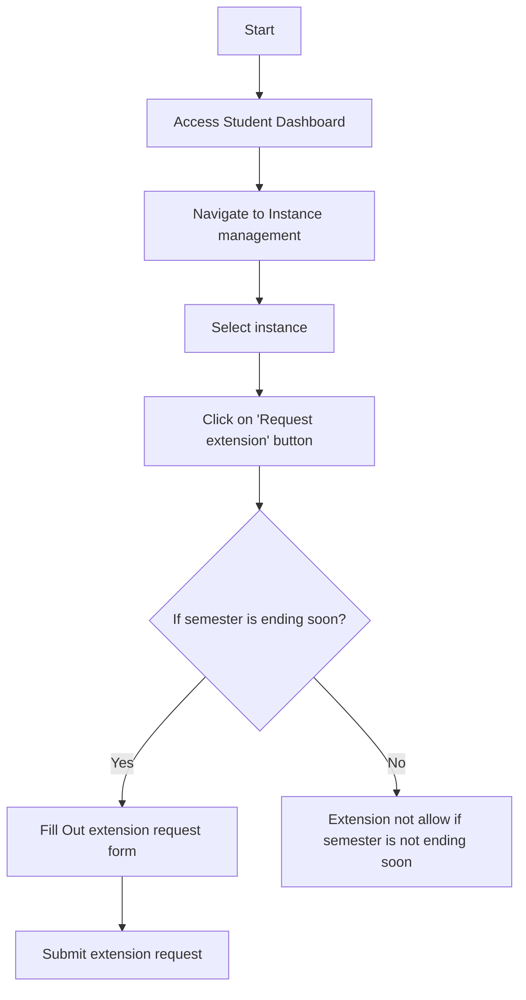

- **Instance extension request form details**
  - Required Fields:
    - Title for extension request
    - Description for extension request

#### Reverse Proxy Configuration
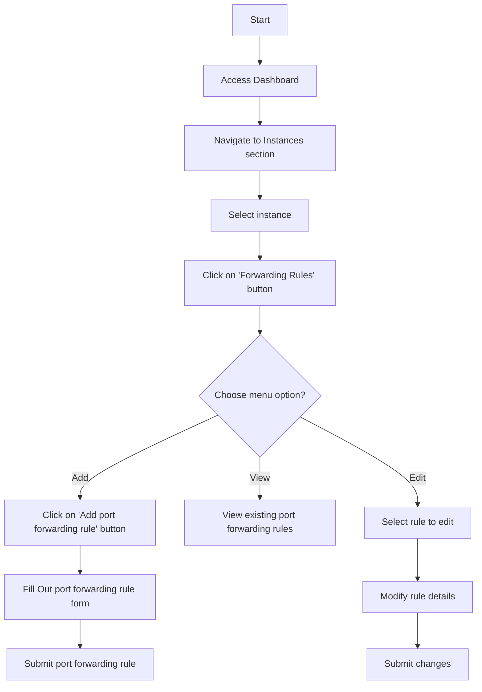

- **Port forwarding rule form details and editing (TCP only)**
  - Port (Required)
  - Description (Optional)

### Lecturer and Admin Flow - Frontend

#### Instance Approval Request
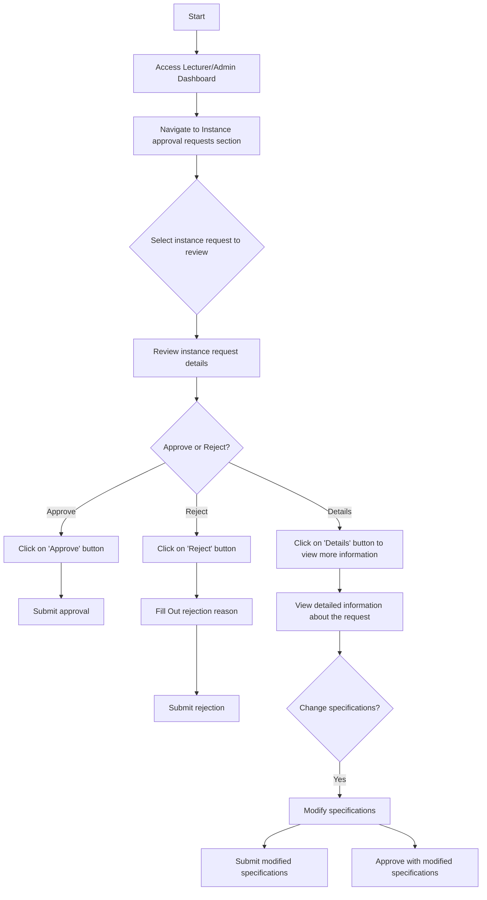

- **Instance approval request form details**
  - Reason (optional)
- **Instance specification modification details**
  - Modifiable Fields:
    - CPU
    - RAM
    - Storage

#### Bulk Approval of Instance Requests
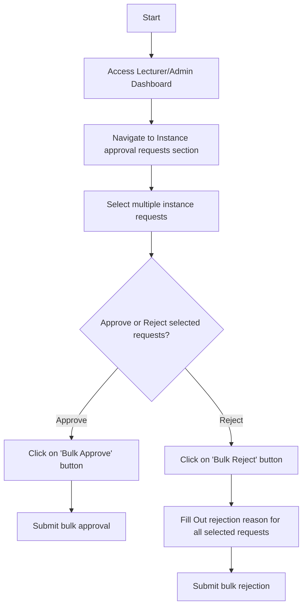

- **Bulk approval/rejection form details**
  - Reason (optional)

#### Instance Extension Approval Request and Bulk Approval
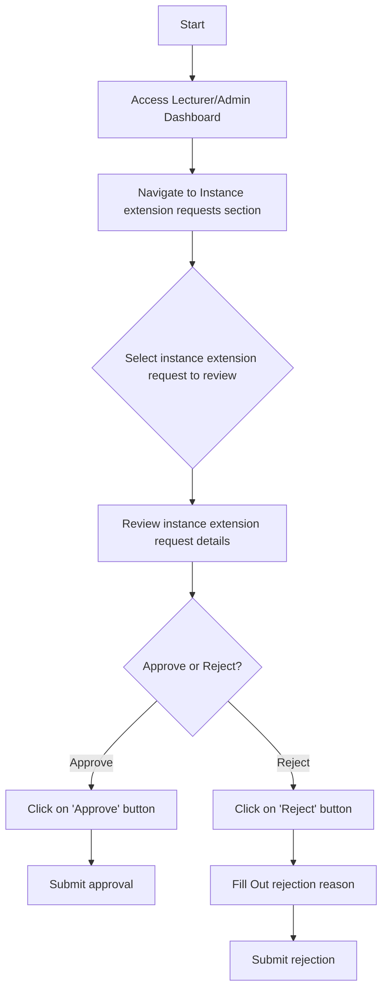

- **Instance extension approval request form details**
  - Reason (optional)

#### Instance Management by Lecturer/Admin
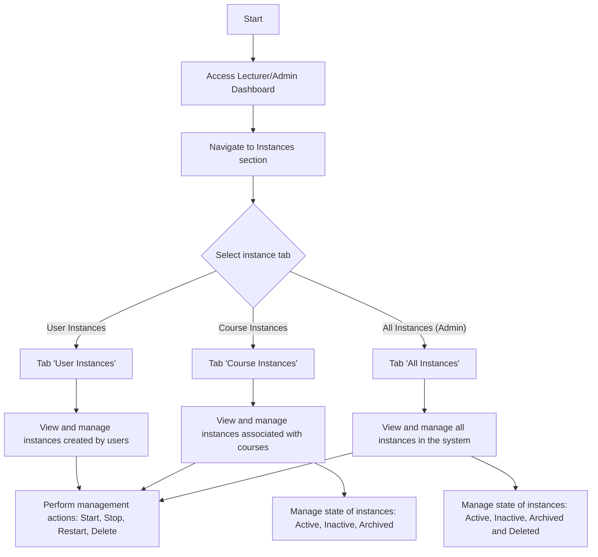

- **Instance management actions**
  - Start
  - Stop
  - Restart
  - Delete
- **Instance states**
  - Active
  - Inactive
  - Archive
  - Delete (Admin only)

### Admin Flow - Frontend

#### Course Management
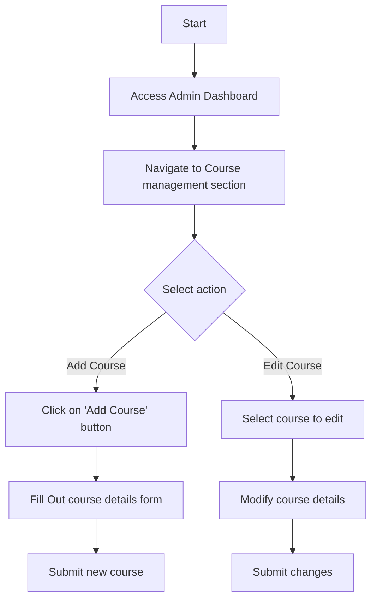

- **Course details form**
  - Course Name (Required)
  - Course Code (Required)
  - Description (Optional)
  - Instructors (Optional) - select from existing lecturers, can be added later, can be multiple instructors

#### Semester Management
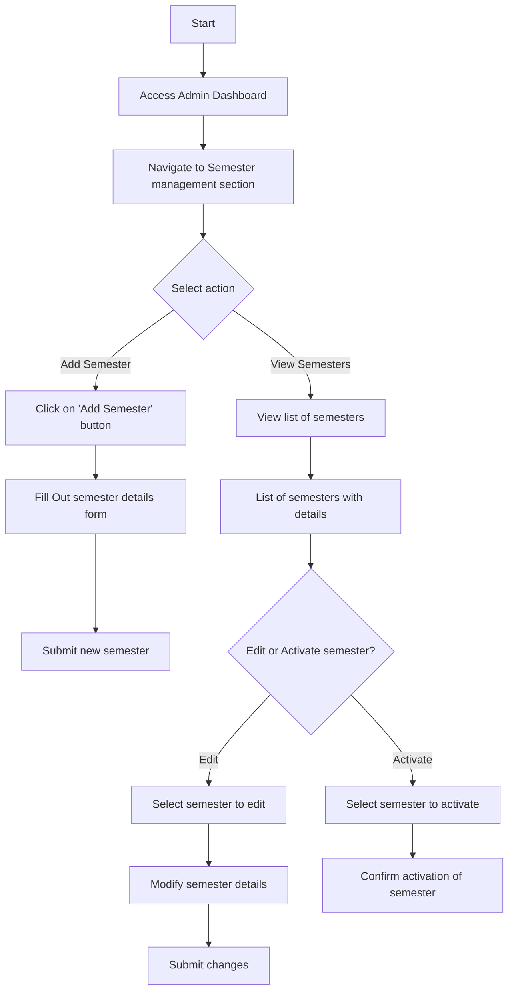

- **Semester details form**
  - Semester Name (Required)
  - Start Date (Required)
  - End Date (Required)

#### Lecture Management
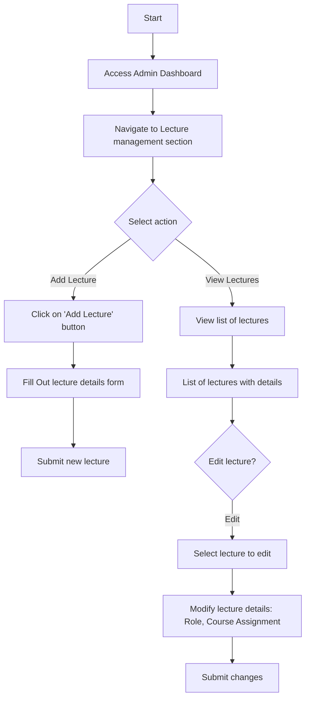

- **Lecture details form**
  - Primary Email (Required)
  - Secondary Email (Optional)
- **Lecture assignment details**
  - Select Course (Optional) - can be multiple courses
  - Select Role (Required) - Lecturer or Admin (Default: Lecturer)