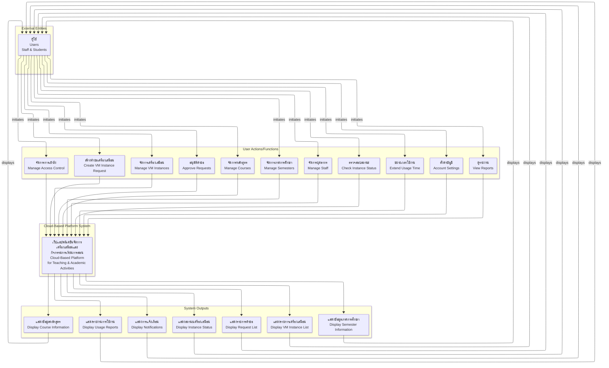

# Context Diagram - Cloud-Based Platform for Supporting Teaching and Academic Activities

## System Overview
This context diagram illustrates the interaction between users and the cloud-based platform system for managing virtual machines and supporting academic activities in the Department of Information Technology.

## Context Diagram

## System Components

### Main System
**Cloud-Based Platform for Supporting Teaching and Academic Activities**
- A web application system that manages virtual machines and supports academic activities
- Built with microservices architecture (Midori, Momoi, Yuzu)
- Provides role-based access control for staff and students

### User Roles
1. **Staff** - Instructors and administrators who can:
   - Approve student requests
   - Manage all VM instances
   - Manage courses and semesters
   - Manage staff accounts

2. **Students** - Users who can:
   - Create VM instance requests
   - Manage their own instances
   - View their request status
   - Extend usage time

### Key Functions
1. **VM Instance Management** - Create, configure, start, stop, and delete virtual machines
2. **Request Management** - Submit and approve VM instance requests
3. **Course Management** - Manage academic courses and their VM requirements
4. **Semester Management** - Manage academic semesters and enrollment periods
5. **Staff Management** - Manage staff accounts and permissions
6. **Access Control** - Role-based authentication and authorization
7. **Monitoring** - Track instance status and resource usage
8. **Reporting** - Generate usage reports and analytics

### System Outputs
1. **VM Instance Lists** - Display available and user's VM instances
2. **Status Information** - Show real-time status of VM instances
3. **Request Lists** - Display pending, approved, and rejected requests
4. **Course Information** - Show available courses and their requirements
5. **Semester Information** - Display current and upcoming semesters
6. **Usage Reports** - Show resource utilization and usage statistics
7. **Notifications** - Display system alerts and status updates

## Data Flow
1. **User Input** → Users initiate actions through the web interface
2. **System Processing** → The platform processes requests through its microservices
3. **Data Storage** → Information is stored in PostgreSQL database
4. **VM Operations** → VM management is handled through Proxmox VE integration
5. **Output Display** → Results are displayed back to users through the web interface

## Technology Stack
- **Frontend**: Next.js with Material UI and Tailwind CSS
- **Backend**: Elysia.js API service
- **VM Management**: Proxmox VE integration
- **Database**: PostgreSQL with Prisma ORM
- **Message Queue**: RabbitMQ for asynchronous operations
- **Authentication**: BetterAuth for secure access control
